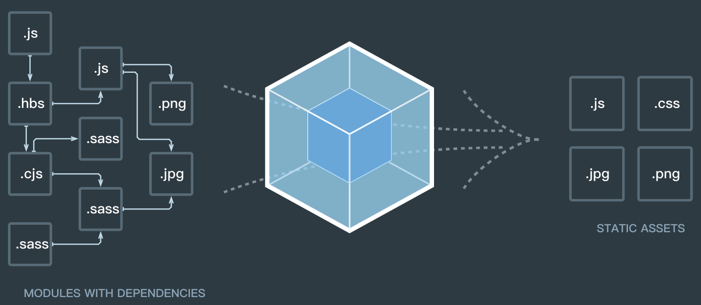

## 1. 什么是 webpack

webpack 可以看做是模块打包机。当 webpack 处理应用程序时，它会递归地构建一个依赖关系图(dependency graph)，其中包含应用程序需要的每个模块，然后将所有这些模块打包成一个或多个 bundle。



## 2. webpack 可以实现功能

通过安装各种 loader 和 plugin，webpack 可以只要可以实现以下功能：

* 代码转换：`TypeScript` 编译成 `JavaScript`，`less、scss` 编译成 `css` 等；
* 文件压缩：压缩 `JavaScript`、`css`、`html` 代码，压缩合并雪碧图；
* 代码校验：使用 `eslint` 相关插件可以实现实时代码校验；
* 代码分割：提取多个页面的公共代码实现按需加载；
* 模块合并：将一个功能的多个模块文件合并成一个文件；
* 自动刷新：监听本地源代码的变化，自动重新构建、刷新浏览器；
* 扩展性强，插件机制完善以及插件丰富。

## 3. webpack 的安装

安装 Node.js 和 NPM

```shell
nvm install v10.15.3

# 检查是否安装成功：
node -v && npm -v
```

创建空目录和 package.json

```shell
mkdir my-project
cd my-project
npm init
```

安装 webpack 和 webpack-cli
```shell
npm install webpack webpack-cli --save-dev

# 检查是否安装成功
./node_modules/.bin/webpack -v
```

## 4. 运行 webpack

```shell
# 在控制台运行
npx webpack
or
./node_modules/.bin/webpack
```

## 5. 核心概念

在了解 webpack 前 ，需要掌握以下几个核心概念，以便后续的理解：

* `entry`：打包的入口文件，webpack 执行打包构建的第一步将从 `entry` 开始；
* `output`：项目的出口文件，webpack 会将构建完成的文件输出到这个目录下；
* `module`：在 webpack 的世界中一切都是模块。webpack 会根据模块的依赖关系递归的构建出一个依赖关系图。
* `loader`：webpack 本身只理解 `JavaScript`，`loader` 让 webpack 能够去处理那些非 `JavaScript` 文件。loader 可以将所有类型的文件转换成 webpack 能够处理的有效模块，然后利用 webpack 的打包能力对它们进行处理；
* `plugins`：`loader` 用于模块转换，而 `plugins` 则用于 `loader` 无法处理的任务，包括但不限于：代码压缩、分割、热更新等；
* `chunk`：代码块，一个 `chunk` 由多个模块组合而成，用于代码合并与分割；
* `bundle`：跟 `chunk` 是一一对应的关系；

## 6. 流程概述

* `初始化参数`：webpack 从配置文件和 `shell` 语句中读取合并参数，得出最终参数；
* `开始编译`：用得到的参数初始化 `Compiler` 对象，加载所有配置的 `plugin`，执行对象的 `run` 方法开始执行编译；
* 确定入口：根据配置中的 `entry` 参数找出所有的入口文件；
* 编译模块：从入口文件出发，调用所有配置的 `loader` 对模块进行转换，再递归的找出模块的依赖，形成依赖关系图以及每个模块的最终内容；
* 输出资源：根据入口和模块之间的依赖关系，组装成一个个包含多个模块的 `chunk`，再把 `chunk` 转换成一个单独文件加入到输出列表中；
* 输出完成：确定输出内容后，根据配置文件的输出路径和文件名，把文件内容写入文件系统中。

## 参考资料

* [webpack原理](https://segmentfault.com/a/1190000015088834)