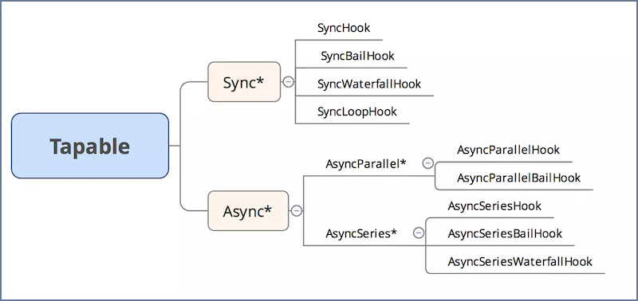

## 1. 介绍

这个仓库介绍了 webpack 核心模块 `Tapable` 的原理和使用，同时手动实现了 `Tabpable` 的各个钩子。

## 2. 如何使用

克隆仓库

```shell
git clone git@github.com:rogan-chen/build-tools-core.git
```

安装依赖

```shell
cd webpack/tapable-demos
npm install or yarn install
```

运行 demo

```shell
cd 1.1-tapable-demo
```

执行 `index.js` 文件

## 3. 前言

- webpack 本质上是一种**事件流机制**，它的工作流程就是将各个插件串联起来，而实现这一切的核心就是 `Tapable`。`Tapable` 的实现原理依赖于**发布订阅模式**。
- 通过事件和注册和监听，触发webpack生命周期中的函数方法
- 在具体介绍webpack内置插件与钩子可视化工具之前，我们先来了解一下webpack中的插件机制。webpack实现插件机制大体方式是：
    - 创建：webpack在其内部对象上创建各种钩子
    - 注册：插件将自己的方法注册到对应钩子上，交给webpack
    - 调用：webpack编译过程中，会实时的触发响应钩子，因此也就触发了插件的方法

## 4. Tapable Hooks 总览

```JavaScript
const {
    SyncHook,
    SyncBailHook,
    SyncWaterfallHook,
    SyncLoopHook,
    AsyncParallelHook,
    AsyncParallelBailHook,
    AsyncSeriesHook,
    AsyncSeriesBailHook,
    AsyncSeriesWaterfallHook
 } = require("tapable");
```

| 钩子名称 | 执行方式 | 注册监听 | 触发事件 |
| :-: | :-: | :-: | :-: | :-: |
| `SyncHook` | 同步串行 | `tap` | `call` |
| `SyncBailHook` | 同步串行 | `tap` | `call` |
| `SyncWaterfallHook` | 同步串行 | `tap` | `call` |
| `SyncLoopHook` | 同步串行 | `tap` | `call` |
| `AsyncParallelHook` | 异步并行 | `tapAsync`、`tapPromise` | `callAsync`、`promise` |
| `AsyncParallelBailHook` | 异步并行 | `tapAsync`、`tapPromise` | `callAsync`、`promise` |
| `AsyncSeriesHook` | 异步串行 | `tapAsync`、`tapPromise` | `callAsync`、`promise` |
| `AsyncSeriesBailHook` | 异步串行 | `tapAsync`、`tapPromise` | `callAsync`、`promise` |
| `AsyncSeriesWaterfallHook` | 异步串行 | `tapAsync`、`tapPromise` | `callAsync`、`promise` |

> Hook类型可以分为`同步Sync`和`异步Async`，异步又分为`并行`和`串行`

## 5. SyncHook

- `SyncHook` 是同步串行执行，不关心事件的返回值。在触发事件后，事件会按照注册的顺序执行。
- 所有的构造函数都接受一个可选参数，参数是一个参数名的字符串数组
- 参数的名字可以任意填写，但是参数数组的长度必须要根据实际接收的参数个数一致
- 如果回到函数不接受参数，可以传入空数组
- 在实例化的时候传入的数组长度有用，值没有用途
- 执行call时，参数个数和实例化时的数组长度有关
- 回调的时候是按照先入先出的顺序执行的，先放的先执行 

演示样例：[SyncHook-demo](./tapable-demos/SyncHook-demo)

## 6. SyncBailHook

`SyncHook` 是同步串行执行，根据当前事件的返回值，决定是否执行后续的事件：

* 如果当前事件的返回值为 `undefined`，那么就执行下一个事件；
* 如果当前事件的返回值不为 `undefined`，那么会跳过后续事件，即不再执行后续事件。

演示样例：[SyncBailHook-demo](./tapable-demos/SyncBailHook-demo)

## 7. SyncWaterfallHook

`SyncWaterfallHook` 是同步串行执行，当前事件的返回值，会作为参数传递给下一个事件。

演示样例：[SyncWaterfallHook-demo](./tapable-demos/SyncWaterfallHook-demo)

## 8. SyncLoopHook

`SyncLoopHook` 是同步串行执行，如果当前事件的返回值不为 `undefined`，那么会重复执行当前事件，直到当前事件的返回值为 `undefined` 为止。

演示样例：[SyncLoopHook-demo](./tapable-demos/SyncLoopHook-demo)

## 9. AsyncParallelHook

`AsyncParallelHook` 是异步并行执行。当所有事件完毕后，将执行回调函数。

演示样例：[AsyncParallelHook-demo](./tapable-demos/AsyncParallelHook-demo)

## 10. AsyncParallelBailHook

`AsyncParallelBailHook` 是异步并行执行。如果当前事件的返回值为 `undefined` 或者 `reject`，那么将立即执行回调函数。否则将执行下一个事件，直到所有事件执行完毕后，才执行回调函数。

演示样例：[AsyncParallelBailHook-demo](./tapable-demos/AsyncParallelBailHook-demo)

## 11. AsyncSeriesHook

`AsyncSeriesHook` 是异步串行执行。当所有事件执行完毕后，将执行回调函数。

演示样例：[AsyncSeriesHook-demo](./tapable-demos/AsyncSeriesHook-demo)

## 12. AsyncSeriesBailHook

`AsyncSeriesBailHook` 是异步串行执行。如果当前事件的返回值为 `undefined` 或者 `reject`，那么将立即执行回调函数。否则将执行下一个事件，直到所有事件执行完毕后，才执行回调函数。

演示样例：[AsyncSeriesBailHook-demo](./tapable-demos/AsyncSeriesBailHook-demo)

## 13. AsyncSeriesWaterfallHook

`AsyncSeriesWaterfallHook` 是异步串行执行。当前执行事件的返回值，将作为参数传递给下一个事件，当所有事件执行完毕后，将执行回调函数。

演示样例：[AsyncSeriesWaterfallHook-demo](./tapable-demos/AsyncSeriesWaterfallHook-demo)

## 14. 参考资料

#### 官方文档

> [https://github.com/webpack/tapable](https://github.com/webpack/tapable)

#### webpack详解

> [https://juejin.im/post/5aa3d2056fb9a028c36868aa#heading-3](https://juejin.im/post/5aa3d2056fb9a028c36868aa#heading-3)

#### Webpack 核心模块 tapable 解析

> [https://www.jianshu.com/p/273e1c9904d2](https://www.jianshu.com/p/273e1c9904d2)