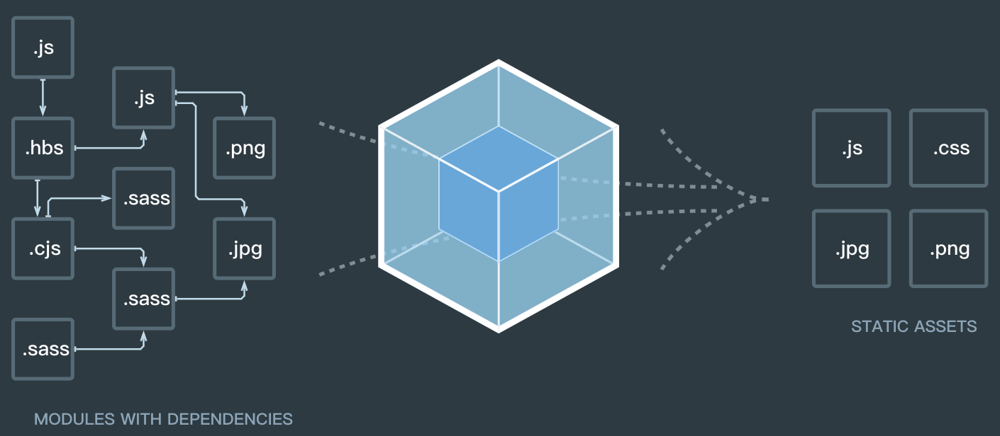

## 1. 什么是 webpack

webpack可以看做是模块打包机：他做的事情是，分析你的项目结构，找到JavaScript模块以及其他的一些资源浏览器不能直接运行的拓展语言（scss、typescript），并将其打包成合适的格式以供浏览器使用。



## 2. webpack 可以实现功能

构建就是把源代码转换成发布到线上的可执行JavaScript、CSS、HTML代码，包括如下内容：

- 代码转换：typescript编译成JavaScript、SCSS编译成CSS等
- 文件优化：压缩JavaScript、CSS、HTML代码，压缩合并图片
- 代码分割：提多个页面的公共代码、提首屏不需要执行部分的代码让其异步加载
- 模块合并：在采用模块化的项目中会有很多模块和文件，需要构建功能把模块分类合并成一个文件
- 自动刷新：监听本地源代码的变化，自动重新构建，刷新浏览器
- 代码校验：在代码被提交到仓库前需要检验代码是否符合规范、以及单元测试是否通过
- 自动发布：更新完代码后，自动构建出线上发布代码并传输给发布系统

构建其实是工程化、自动化思想在前端开发中的体现，把一系列流程用代码实现，让代码自动化的执行这一系列复杂流程，构建给前端开发注入了更大的活力，解放了我们的生产力

## 3. webpack 的安装

安装 Node.js 和 NPM

```shell
nvm install v10.15.3

# 检查是否安装成功：
node -v && npm -v
```

创建空目录和 package.json

```shell
mkdir my-project
cd my-project
npm init
```

安装 webpack 和 webpack-cli
```shell
npm install webpack webpack-cli --save-dev

# 检查是否安装成功
./node_modules/.bin/webpack -v
```

## 4. 运行 webpack

```shell
# 在控制台运行
npx webpack
or
./node_modules/.bin/webpack
```

## 5. 核心概念

在了解 webpack 前 ，需要掌握以下几个核心概念，以便后续的理解：

- entry：入口，webpack执行构建的第一步将从entry开始，可抽象成输入
- module：模块，在webpack里一切皆模块，一个模块对应着一个文件，webpack会从配置的entry开始递归找出所有依赖的模块
- chunk：代码块，一个chunk有多个模块组合而成，用于代码合并与分割
- loader：模块转换器，用于把模块原内容按照需求转换成新内容
- plugin：扩展插件，在webpack构建流程中的特定时机注入扩展逻辑来改变构建结果或者做你想要做的事情
- output：输出结果，在webpack经过一系列处理并得出最终想要的代码后输出结果

> webpack启动后会从entry里配置的module开始递归解析entry依赖的所有module，每找到一个module，就会根据配置的loader去找出对应的转换规则，对module进行转换后，在解析出当前module依赖的module。这些模块会议entry为单位进行分组，一个entry和它所依赖的module备份到一个组，也就是一个chunk，最后webpack会把所有chunk转换成文件输出。在整个流程中会webpack会在恰当的时机执行plugin里定义的逻辑。

## 6. 流程概述

* `初始化参数`：webpack 从配置文件和 `shell` 语句中读取合并参数，得出最终参数；
* `开始编译`：用得到的参数初始化 `Compiler` 对象，加载所有配置的 `plugin`，执行对象的 `run` 方法开始执行编译；
* 确定入口：根据配置中的 `entry` 参数找出所有的入口文件；
* 编译模块：从入口文件出发，调用所有配置的 `loader` 对模块进行转换，再递归的找出模块的依赖，形成依赖关系图以及每个模块的最终内容；
* 输出资源：根据入口和模块之间的依赖关系，组装成一个个包含多个模块的 `chunk`，再把 `chunk` 转换成一个单独文件加入到输出列表中；
* 输出完成：确定输出内容后，根据配置文件的输出路径和文件名，把文件内容写入文件系统中。

## 7. mode

webpack的mode配置用于提供模式配置选项告诉webpack相应的使用其内置的优化，mode有以下三个可选值：development、production、none：

- common

```JavaScript
// parent chunk中解决了的chunk会被解决
optimization.removeAvailabelModules: true

// 删除空的chunks
optimization.removeEmptyChunks: true

// 合并重复的chunk
optimization.mergeDuplicateChunks: true
```

- development

```JavaScript
// 调试
devtool: eval

// 缓存模块，避免在未更改时重建他们
cache: true

// 缓存以及解决的依赖项， 避免重新解析他们
module.unsafeCache: true

// 在bundle中引入「所包含模块信息」的相关注释
output.pathinfo: true

// 在可能的情况下确定每个模块的导出，被用于其他优化或者代码生成
optimization.providedExports: true

// 找到chunk中共享的模块，取出来生成单独的chunk
optimization.splitChunks: true

// 为webpack运行时代码创建单独的chunk
optimization.runtimeChunk: true

// 编译错误时候不写入到输出
optimization.noEmitOnErrors: true

// 给模块有意义的名称替代ids
optimization.namedChunks: true
```

- production

```JavaScript
// 性能相关配置
performance: { hints: 'error' ... }

// 某些chunk的子chunk以一种被确定和标记，这些子chunks在加载更大的块时不必加载
optimization.flagIncludedChunks: true

// 给经常使用的ids更短的值
optimization.occurrenceOrder: true

// 确定每个模块下被使用的导出
optimization.usedExports: true

// 识别package.json or rules.sideEffects标志
optimization.sideEffects: true

// 尝试查找模块图中可以安全连接到单个模块中的段
optimization.concatenateModules: true

// 使用uglify-js压缩代码
optimization.minimize: true
```

## 参考资料

* [webpack原理](https://segmentfault.com/a/1190000015088834)