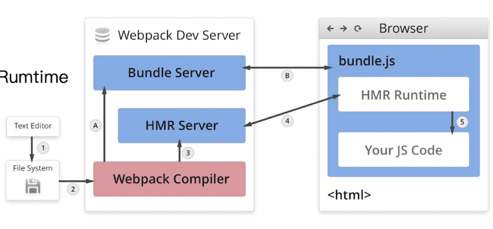
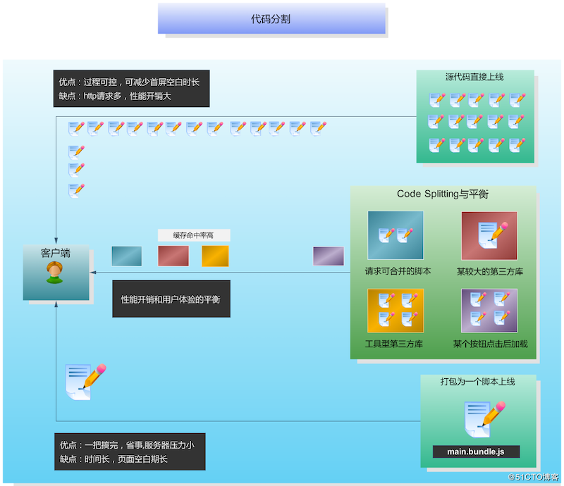

## 前言

这个仓库收集了 webpack 的配置示例。

## 如何使用

安装依赖：

```shell
cd config-demos
npm install
```

运行 demo，例如运行 1.1-config-demo：

```shell
cd webpack/1.1-config-demo

# 运行 webpack.config.js 文件
npx webpack

# 运行 webpack.xxx.config.js 文件
npx webpack --config webpack.xxx.config.js
```

## 目录

* 1 [常用配置](#1)
    * 1.1 [打包 HTML](#1.1)
    * 1.2 [打包 CSS](#1.2)
        * 1.2.1 [编译 less 文件并打包 CSS 模块](#1.2.1)
        * 1.2.2 [将 CSS 代码放入单独的文件夹中](#1.2.2)
        * 1.2.3 [CSS 代码添加前缀和压缩](#1.2.3)
    * 1.3 [babel 插件](#1.3)
    * 1.4 [JavaScript 语法校验](#1.4)
    * 1.5 [变量全局注入](#1.5)
        * 1.5.1 [expose-loader 注入](#1.5.1)
        * 1.5.2 [ProvidePlugin 注入](#1.5.2)
        * 1.5.3 [外部引用不打包](#1.5.3)
    * 1.6 [打包图片](#1.6)
        * 1.6.1 [打包 CSS、JavaScript 中的图片](#1.6.1)
        * 1.6.2 [打包 HTML 中 img 标签的图片](#1.6.2)
    * 1.7 [文件监听](#1.7)
        * 1.7.1 [watch](#1.7.1)
        * 1.7.2 [热更新](#1.7.2)
    * 1.8 [文件指纹](#1.8)
* 2 [进阶配置](#2)
    * 2.1 [打包多页应用](#2.1)
    * 2.2 [配置 source-map](#2.2)
    * 2.3 [文件操作 && 版权声明](#2.3)
    * 2.4 [定义环境变量](#2.4)
    * 2.5 [区分不用环境](#2.5)
    * 2.6 [优化命令行的构建日志](#2.6)
    * 2.7 [基础库分离](#2.7)
    * 2.8 [懒加载](#2.8)
* 3 [打包体积优化](#3)
    * 3.1 [体积分析](#3.1)
    * 3.2 [Tree Sharking](#3.2)
    * 3.3 [使用 Tree Sharking 檫除无用的 CSS](#3.3)
    * 3.4 [预编译资源模块（推荐）](#3.4)
    * 3.5 [并行压缩 JavaScript 代码](#3.5)
    * 3.6 [图片压缩](#3.6)
    * 3.7 [动态 Polyfill](#3.7)
    * 3.8 [代码分割](#3.8)
    * 3.9 [ScopeHoisting 使用和原理分析](#3.9)
* 4 [打包速度优化](#4)
    * 4.1 [速度分析](#4.1)
    * 4.2 [多线程/多进程构建](#4.2)
    * 4.3 [使用缓存提升二次构建速度](#4.3)
    * 4.4 [缩小构建目标](#4.4)
    * 4.5 [减少文件搜索范围](#4.5)
    * 4.6 [不去解析依赖关系](#4.6)

## 1. 常用配置<span id='1'></span>

#### 1.1 打包 HTML<span id='1.1'></span>

`html-webpack-plugin` 用于打包 HTML 模块，并提供压缩功能。

安装依赖：

`npm install --save-dev html-webpack-plugin`

演示样例：[1.1-config-demo](./config-demos/1.1-config-demo)

#### 1.2 打包 CSS<span id='1.2'></span>

##### 1.2.1 编译 `less` 文件并打包 `CSS` 模块<span id='1.2.1'></span>

* `style-loader` 用于将 `CSS` 代码插入到 HTML 模块的 `style` 标签中；
* `css-loader` 用于解析 `@import` 语法；
* `less-loader` 可以将 `less` 代码编译成 `CSS` 代码。

安装依赖：

```shell
npm install --save-dev style-loader css-loader less-loader
```

> loader 的解析是有顺序的（从右向左），所以插件的顺序不能乱。

##### 1.2.2 将 CSS 代码放入单独的文件夹中<span id='1.2.2'></span>

`mini-css-extract-plugin` 用于将 `CSS` 代码打包成一个文件。

安装依赖：

```shell
npm install --save-dev mini-css-extract-plugin
```

> `style-loader` 和 `mini-css-extract-plugin` 的作用互斥，两者不能在同一个 `rule` 中使用。

##### 1.2.3 CSS 代码添加前缀和压缩<span id='1.2.3'></span>

* `optimize-css-assets-webpack-plugin`、`terser-webpack-plugin` 可以实现 `CSS` 和 `JavaScript` 的代码压缩；
* `autoprefixer`、`postcss-loader` 可以给 CSS 代码添加前缀，同时还需要在项目根目录下添加 `postcss.config.js` 配置文件。

安装依赖：

```shell
npm install --save-dev optimize-css-assets-webpack-plugin terser-webpack-plugin autoprefix postcss-loader
```

演示样例：[1.2-config-demo](./config-demos/1.2-config-demo)

#### 1.3 babel 插件<span id='1.3'></span>

* `babel-loader` 用于 `JavaScript` 代码转换；
* `@babel/preset-env` 用于将 `ES6` 代码转成 `ES5` 代码；
* `@babel/preset-react` 用于解析 `react` 和 `JSX` 代码；
* `@babel/plugin-proposal-decorators` 用于解析装饰器；
* `@babel/plugin-proposal-class-properties` 用于解析 `class` 语法；
* `@babel/plugin-transform-runtime` 用于避免重复引入辅助代码。

安装依赖：

```shell
npm install --save-dev babel-loader \
@babel/preset-env @babel/preset-react \
@babel/plugin-proposal-decorators \
@babel/plugin-proposal-class-properties \
@babel/plugin-transform-runtime
```

演示样例：[1.3-config-demo](./config-demos/1.3-config-demo)

#### 1.4 JavaScript 语法校验<span id='1.4'></span>

`eslint-loader` 提供 `JavaScript` 语法检测功能，同时你还需要在项目根目录下添加 `.eslintrc.js` 文件。

安装依赖：

```shell
npm install --save-dev eslint eslint-loader
```

演示样例：[1.4-config-demo](./config-demos/1.4-config-demo)

#### 1.5 变量全局注入<span id='1.5'></span>

##### 1.5.1 expose-loader 注入<span id='1.5.1'></span>

`expose-loader` 可以将变量注入到 `window` 对象中。

安装依赖：

```shell
npm install --save-dev expose-loader
```

##### 1.5.2 ProvidePlugin 注入<span id='1.5.2'></span>

`ProvidePlugin` 可以将变量注入到每个模块中。

##### 1.5.3 外部引用不打包<span id='1.5.3'></span>

可以通过在 `HTML` 代码中的 `script` 标签来引入外部资源，同时通过 `externals` 参数告诉 webpack 不要将这个资源打包进 `bundle` 里面。

演示样例：[1.5-config-demo](1.5-config-demo)

#### 1.6 打包图片<span id='1.6'></span>

##### 1.6.1 打包 CSS、JavaScript 中的图片<span id='1.6.1'></span>

* `file-loader` 可以打包比如图片、字体等静态资源文件；
* `url-loader` 可以设置 `limit` 参数，当资源文件的超过 `limit` 大小时，资源文件会被 `file-loader` 打包；当资源文件小于 * `limit` 大小时，会被编译成 Base64 码。

安装依赖：

```shell
npm install --save-dev file-loader url-loader
```

##### 1.6.2 打包 HTML 中 img 标签的图片<span id='1.6.2'></span>

`html-withimg-loader` 可以处理 `HTML` 代码中 `img` 标签无法引用图片的问题。

安装依赖：

```shell
npm install --save-dev html-withimg-loader
```

> `file-loader` 和 `html-withimg-loader` 同时使用时，`file-loader` 的版本必须小于 5.0.0。

演示样例：[1.6-config-demo](./config-demos/1.6-config-demo)

#### 1.7 文件监听<span id='1.7'></span>

文件监听是在源代码发生变化时，webpack 自动重新构建出新的项目文件。

##### 1.7.1 watch<span id='1.7.1'></span>

`watch` 开发监听模式的用法有两种：

* 启动 webpack 命令时，带上 `--watch` 参数；
* 在 webpack.config.js 文件中设置 `watch: true`。

`watch` 原理分析：webpack 会轮训判断文件的最后编辑时间是否变化。如果编辑时间发生变化，那么 webpack 并不会立即告诉监视器，而是先缓存起来，等待 `aggregateTimeout` 后再重新构建。

`watch` 的缺点：每次构建完之后都需要手动刷新浏览器。

演示样例：[1.7.1-config-demo](./config-demos/1.7.1-config-demo)

##### 1.7.2 热更新<span id='1.7.2'></span>

`webpack-dev-server` 不需要手动刷新浏览器，同时不会触发构建输出文件，而是将文件存放在内存中。

热更新的原理分析：

* `webpack compiler`：将 JS 编译成 `Bundle` 文件；
* `HMR Server`：将热更新的文件输出给 `HMR Runtime`；
* `Bundle Server`：提供文件在浏览器的访问；
* `HMR Runtime`：会被注入到浏览器，更新文件的变化；
* `bundle.js`：构建输出的文件。



#### 1.8 文件指纹<span id='1.8'></span>

- 打包后输出的文件名和后缀名
- hash一般是结合CDN缓存来使用的，通过webpack构建之后，生成对应文件名自动带上对应的MD5值。如果文件内容改变的话，那么对应文件哈希值也会改变，对应的HTML引用的URL地址也会改变，触发CDN服务器从原服务器上拉去对应数据，进而更新本地缓存。

###### 1.8.1 文件指纹如何生成

* `Hash`：和**整个项目**的构建相关，只要项目文件修改，整个项目构建的 `hash` 值就会更改；
* `Chunkhash`：和 webpack 打包的 **`chunk`** 相关，不同的 `entry` 会生成不同的 `chunkhash` 值；
* `Contenthash`：根据**文件内容**来定义 `hash`，文件内容不变，则 `contenthash` 不变；

###### 1.8.2 占位符用法

| 占位符名称 | 含义 |
| :-: | :-: |
| `[ext]` | 资源后缀名 |
| `[name]` | 文件名称 |
| `[path]` | 文件相对路径 |
| `[folder]` | 文件所在的文件夹名称 |
| `[chunkhash]` | `chunk` 的 `hash`，默认 `md5` 生成 |
| `[contenthash]` | 文件内容 `hash`，默认是 `md5` 生成 |
| `[hash]` | 项目的 `hash`，默认 `md5` 生成 |
| `[emoji]` | 一个随机指代文件内容的 emoji |

###### 1.8.3 具体用法

* `JavaScript` 文件：设置 `output` 的 `filename`，使用 `[chunkhash]`；
* `CSS` 文件：设置 `MiniCssExtractPlugin` 的 `filename`，使用 `[contenthash]`；
* 图片：设置 `file-loader` 的 `name`，使用 `[hash]`；

演示样例：[1.8-config-demo](./config-demos/1.8-config-demo)

## 2. 进阶配置<span id='2'></span>

#### 2.1 打包多页应用<span id='2.1'></span>

每个页面对应一个 `entry` 和一个 `html-webpack-plugin`。
这样做的缺点是不够通用，每次新增或者删除页面都需要手动修改 `webpack.config.js` 的配置。

演示样例：[2.1-config-demo/webpack.config.js](./config-demos/2.1-config-demo/webpack.config.js)

#### 2.2 配置 source-map<span id='2.2'></span>

* `source-map`：单独生成一个映射文件，报错会标识错误的行；
* `eval-source-map`：不会产生映射文件，报错会标识错误的行；
* `cheap-module-source-map`：产生映射文件，报错不会标识错误的行；
* `cheap-module-eval-source-map`：：不会产生映射文件，报错不会标识错误的行。

> `source-map` 在开发模式下有利于代码调试，但是不应该在生产模式下启用，避免耗能；

演示样例：[2.2-config-demo](./config-demos/2.2-config-demo)

#### 2.3 文件操作 && 版权声明<span id='2.3'></span>

* `BannerPlugin` 可以在打包的 `JavaScript` 文件内容前端添加自定义的内容；
* `copy-webpack-plugin` 可以将指定目录的文件拷贝到 `output` 目录下；
* `clean-webpack-plugin` 可以在每次打包构建前清空 `output` 的文件内容。

演示样例：[2.3-config-demo](./config-demos/2.3-config-demo)

#### 2.4 定义环境变量<span id='2.4'></span>

`DefinePlugin` 可以将定义的变量**_替换_**到代码中。

演示样例：[2.4-config-demo](./config-demos/2.4-config-demo)

#### 2.5 区分不用环境<span id='2.5'></span>

演示样例：[2.5-config-demo](./config-demos/2.5-config-demo)

#### 2.6 优化命令行的构建日志<span id='2.6'></span>

`friendly-errors-webpack-plugin` 用于优化命令行的构建日志：

* `success`：构建成功的日志提示,，绿色提示；
* `warning`：构建警告的日志提示，黄色提示；
* `error`：构建报错的日志提示，红色提示。

前提是需要将 `state` 设置成 `errors-only`。

#### 2.7 基础库分离<span id='2.7'></span>

使用 `html-webpack-externals-plugin` 将 react、react-dom 基础包通过 `cdn` 引入，不打入 `bundle` 文件中。

> 这个插件的用法，与 `externals` 参数类似。

#### 2.8 懒加载<span id='2.8'></span>

* CommonJS：require.ensure；
* ES6：动态 import，只有用到 `js` 模块才会加载，目前处于提案阶段。

演示样例：[2.8-config-demo](./config-demos/2.8-config-demo)

## 3. 打包体积优化<span id='3'></span>

#### 3.1 体积分析<span id='3.1'></span>

`webpack-bundle-analyzer` 打包构建完后会在 8888 端口展示大小，可以用于分析以下问题：

* 依赖的第三方模块文件大小；
* 业务里面的组件代码大小。

演示样例：[4.1-config-demo](./config-demos/4.1-config-demo)

#### 3.2 Tree Sharking<span id='3.2'></span>

**_定义_**

一个模块可能有多个方法，在 webpack2.0 以前，只要模块中的一个方法被用到，整个模块都会被打包进 `bundle`；webpack 2.0 以后，通过 `tree sharking` 的作用，可以实现只把用到的方法打包进 `bundle`，其他方法被檫除掉。webpack 4.0 中，`production` 模式下默认开启 `tree sharking`。

**_tree sharking 使用要求_**

必须使用 ES6 的 `import`、`export` 语法，`CommonJS` 的语法不支持。

**_tree sharking 实现原理_**

Dead Code Elimination：

* 代码不会被执行，不可到达（用于无法满足条件的判断）；
* 代码执行的结果不会被用到（定义未使用）；
* 代码只会影响死变量（定义未使用）；

利用 ES6 模块的特点：

* 只能作为模块顶层的语句出现；
* `import` 的模块名只能是字符串常亮；
* `import binding` 是 `immutable` 的；
* 编译时执行。

演示样例：[3.1-config-demo](./config-demos/3.1-config-demo)

#### 3.3 使用 Tree Sharking 檫除无用的 CSS<span id='3.3'></span>

`purgecss-webpack-plugin` 需要和 `mini-css-extract-plugin ` 配合使用。

#### 3.4 预编译资源模块（推荐）<span id='3.4'></span>

`SplitChunks` 适用场景：同一个项目下，被多个模块使用的公共代码；

`DLLPlugin` 适用场景：被多个项目复用的公共库、业务代码；

演示样例：[3.3-config-demo](./config-demos/3.3-config-demo)

#### 3.5 并行压缩 JavaScript 代码<span id='3.5'></span>

`terser-webpack-plugin` 开启 `parallel` 参数。

#### 3.6 图片压缩<span id='3.6'></span>

使用 `image-webpack-loader` 实现。

#### 3.7 动态 Polyfill<span id='3.7'></span>

`polyfill-service` 根据客户端的 `User Agent`，下发不同的 `Polyfill`。

#### 3.8 代码分割<span id='3.8'></span>

代码分割的意义：用可接受的服务器性能压力增加来换取更好的用户体验。

源代码直接上线：虽然过程可控，但是http请求多，性能开销大。

打包成唯一脚本：服务器压力小，但是页面空白期长，用户体验不好。



webpack4.0 废弃了 `CommonsChunkPlugin`，引入了 `optimization.splitChunks` 和 `optimization.runtimeChunk` 来替代，以优化 `chunk` 的拆分。

**_默认的自动代码分割要求_**

* `node_modules` 中的模块或其他被重复引用的模块；
* 分离前模块最小体积下限，默认 30k；
* 对于异步模块，生成的公共模块文件不能超出5个；
* 对于入口模块，抽离出的公共模块文件不能超出3个；

**_参数说明_**

* minSize：最小打包体积，默认 30k；
* minChunks：最小使用次数；
* maxAsyncRequests：所有异步请求不得超过5个；
* maxInitialRequests：初始话并行请求不得超过3个；
* name：打包后的名称，默认是chunk的名字通过分隔符（默认是～）分隔开，如vendor~；
* cacheGroups：设置缓存组用来抽取满足不同规则的chunk；
* priority：权重；

演示样例：[3.7-config-demo](./config-demos/3.7-config-demo)

#### 3.9 ScopeHoisting 使用和原理分析<span id='3.9'></span>

**_导致的问题_**

* 大量闭包函数包裹代码，导致体积增大（模块越多越明显）;
* 运行代码时创建的函数作用域变多，内存开销变大。 

**_原理分析_**

将所有模块的代码按照引用顺序放在一个函数作用域里，然后适当的重新命名一些变量以防止变量名冲突。

通过 scope hoisting 可以减少函数声明代码和内存开销。

**_使用那说明_**

* webpack `mode` 为 `production` 时默认开启；
* 必须使用 `ES6` 语法，`CommonJS` 不支持

## 4. 打包速度优化<span id='4'></span>

#### 4.1 速度分析<span id='4.1'></span>

`speed-measure-webpack-plugin` 可以用打包速度分析：

* 分析整个打包总耗时；
* 每个插件和 `loader` 的耗时情况。

演示样例：[4.1-config-demo](./config-demos/4.1-config-demo)

#### 4.2 多线程/多进程构建<span id='4.2'></span>

* `HappyPack` 不再维护；
* `thread-loader` 推荐；

#### 4.3 使用缓存提升二次构建速度<span id='4.3'></span>

* `babel-loader` 开启缓存；
* `terser-webpack-plugin` 开启缓存；
* 使用 `cache-loader` 或者 `hard-source-webpack-plugin`。

#### 4.4 缩小构建目标<span id='4.4'></span>

* `include`：需要解析的模块；
* `exclude`：不需要解析的模块。

`include` 和 `exclude` 只需要设置一个就可以了。

#### 4.5 减少文件搜索范围<span id='4.5'></span>

* 优化 `resolve.modules` 配置，减少模块搜索层级；
* 优化 `resolve.mainFields` 配置；
* 优化 `resolve.extensions` 配置；
* 合理使用 `alias`。

#### 4.6 不去解析依赖关系<span id='4.6'></span>

`noParse` 表示不去解析某个模块的依赖关系，从而提升构建速度。

## 参考资料

#### 玩转 webpack

> [https://time.geekbang.org/course/intro/100028901](https://time.geekbang.org/course/intro/100028901)

#### 10天搞定webpack4

> [https://www.bilibili.com/video/av51693431](https://www.bilibili.com/video/av51693431)